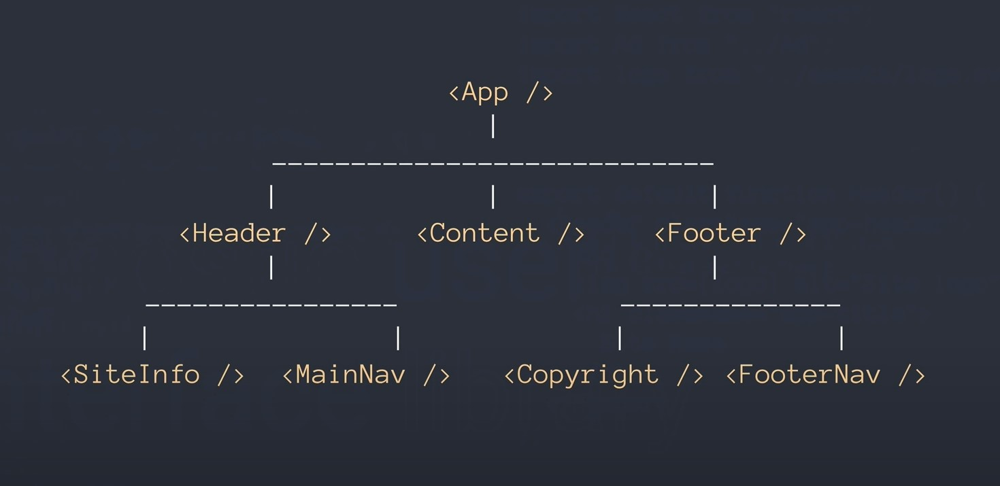
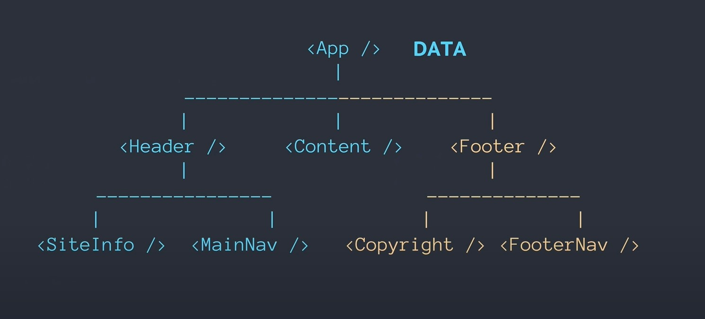

## A High Level Overview Of React

1. What is React?
React is a User Interface Library used to create user interfaces:

- charts
- bars
- search fields
- widget
- websites
- applications
- anything the user will see in the browser

It will look and function like HTML and CSS as expected in JavaScript on the frontend.

2. What is a component?

-  a small piece of code that fills a certain part of the user interface being built with React

3. What is the dataflow of React?

React has a one-way data flow.

4. How do we make a React element a DOM element?

- make a component in React
- pass element into React DOM

In React, an element is just a native JavaScript object and eventually will become a DOM. Moreover, those objects cannot be used as DOM elements can. Although, much can be done with React elements that cannot be done with DOM elements.

5. React is a User Interface ______.

*library*

6. Which direction does data flow in React?

*down*

7. Every component manages its own ____.

*state*

