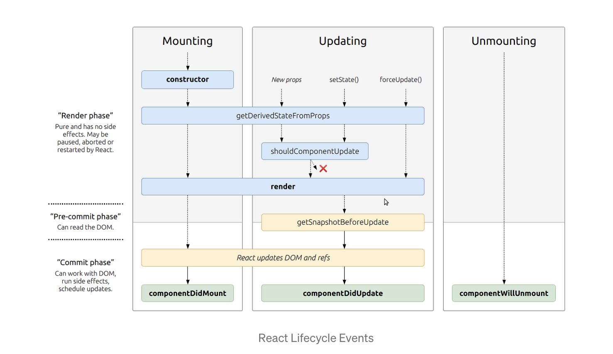

# State and Props

## [React lifecycle](https://medium.com/@joshuablankenshipnola/react-component-lifecycle-events-cb77e670a093)

Component lifecycle events in React refers to the series of stages that a component goes through from initialization to destruction. **Mounting**, **Updating**, and **Unmounting** are the 3 phases of the component lifecycle. 

* Mounting is when an instance of a component is being created and inserted into the DOM and it occurs during the mounting phase. Constructor,static getDerivedStateFromProps, render, componentDidMount, and UNSAFE_componentWillMount all occur in this order during mounting.

* Updating is anytime a component is updated or state changes then it is rerendered. These lifecycle events happen during updating in this order.
static getDerivedStateFromProps, shouldComponentUpdate, render,
getSnapshotBeforeUpdate, componentDidUpdate, UNSAFE_componentWillUpdate, UNSAFE_componentWillReceiveProps

* Unmounting is the last phase of the cycle and its called when a component is being removed from the DOM. componentWillUnmount is the only lifecycle event during this phase. 



1. Based off the diagram, what happens first, the ```render``` or the ```componentDidMount```?
    - ```render``` happens first

2. What is the very first thing to happen in the lifecycle of React?
    - Constructor occurs during the mounting phase of the lifecycle.

3. Put the following things in the order that they happen: ```componentDidMount```, ```render```, ```constructor```, ```componentWillUnmount```, ```React Updates```
    -```constructor``` > ```render``` > ```componentDidMount``` > ```React Updates``` >```componentWillUnmount```

4. What does ```componentDidMount``` do?
    - It is a method that is invoked immediately after a component is mounted. 


## [React State Vs Props](https://www.youtube.com/watch?v=IYvD9oBCuJI)

- State and props are both important concepts in React that deal with managing and passing data between components.

- State refers to an object that holds data that can change over time within a component. It is used to manage and update a component's internal data.

- Props, short for properties, are read-only data that are passed down from a parent component to a child component. They are used to customize a component and can be thought of as the component's configuration.

- One key difference between state and props is that state is managed within a component, while props are passed down from a parent component.

- Another difference is that state can only be updated within the component it belongs to, while props are read-only and cannot be directly changed within the component that receives them.

- To pass data from a parent component to a child component, you can use props. You can also pass down functions as props to allow the child component to update the parent's state.

- To update state within a component, you can use the setState method. This method merges the new state with the existing state, and then triggers a re-render of the component with the updated state.

- It's important to note that when updating state, you should never directly modify the state object, but instead create a new object that represents the updated state.

- When working with state and props, it's important to think about the data flow within your application and how you can structure your components to best manage and pass data between them.

1. What types of things can you pass in the props?

Any javascript value, arrays, object, string etc.

2. What is the big difference between props and state?

State is handled inside of a component and can be changed inside of the component. Props is handled outside of the component and must be changed outside the component.

3. When do we re-render our application?

Whenever the state of a component changes.

4. What are some examples of things that we could store in state?

Something that needs to be changed and re-rendered through the life of a component. A counter or a score is a good example.

## Things I would like to learn more about

[React Docs - State and Lifecycle](https://legacy.reactjs.org/docs/state-and-lifecycle.html)

[React Docs - handling events](https://legacy.reactjs.org/docs/handling-events.html)

[React Tutorial through ‘Developer Tools’](https://react.dev/learn/tutorial-tic-tac-toe)

[React Bootstrap Documentation](https://react-bootstrap.github.io/)

[Bootstrap Cheat Sheet](https://getbootstrap.com/docs/5.0/examples/cheatsheet/)

[Bootstrap Shuffle - a class “sandbox”](https://bootstrapshuffle.com/classes)

[Netlify](https://www.netlify.com/)