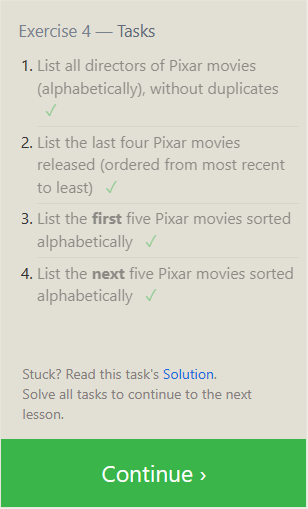
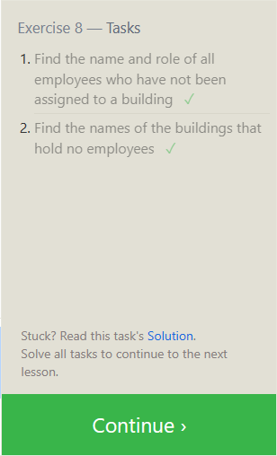
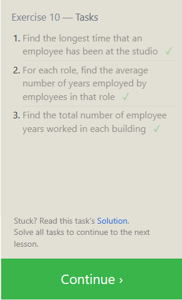
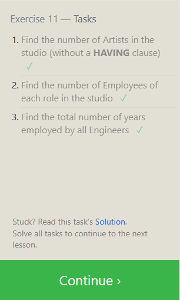
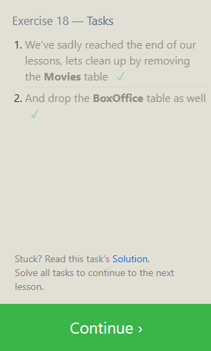

## **Practice**

### [SQL Bolt](https://sqlbolt.com/)

- Lessons 1 through 6 - SQL Queries

- Lessons 13 through 18 - Database Management

 

For each of the tutorial sections:

1. Read the guidance.

2. Complete the exercises.

3. Capture a screen shot of the completed task list.

 

### **Submitting Your Work**

When you are finished with all of the lessons, create a new entry in your reading notes repository summarizing your understanding of relational databases and SQL. Include all of your screen shots in this page.

*Submit a link to your rendered notes page.*

Relational databases organize data into tables. Each table has specified rows and columns from which users can pull data. The ability to join tables are also included since data is usually stored between multiple tables.

 

## Data Structures and Algorithms

**Discussion Questions**

1. What is 1 of the more important things you should consider when deciding which data structure is best suited to solve a particular problem?

> The Big O notation (a measure of how well an operation scales) is how a developer should decide which data structure is best suited to solve a particular problem.

2. How can we ensure that we’ll avoid an infinite recursive call stack?

> The solution is to give the control back to the Event Loop by using techniques such as asynchronous callbacks or promises.

[Avoid Infinite Recursive Call Stack](https://observablehq.com/@mettlex/infinite-recursion-in-javascript-the-easy-way#:~:text=You%20might%20be%20asking%3A%20%22What,from%20exceeding%20its%20maximum%20size.)

## Things I want to know more about