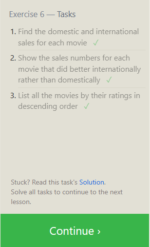
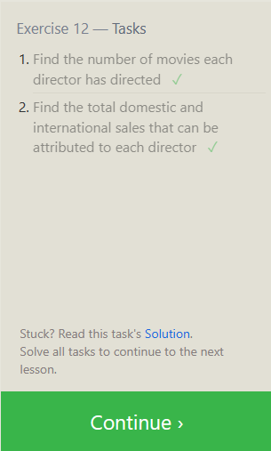

# [SQL Database Tutorial for Beginners](https://www.computer-pdf.com/3-sql-database-tutorial-for-beginners)

SQL - Structured Query Language - *used for managing databases*.

&nbsp;

## **What is SQL Language?**

SQL considered the most popular database programming language worldwide

SQL programmers can access a database to perform queiries and get data out of the database. A variety of databases supports SQL. Commonly used databases include Oracle, SQL Server, MySQL, Sybase, and PostreSQL.

&nbsp;

## **Why should I learn SQL?**

Since SQL is the language used to manage and query databases, I should learn it if that is a task I desire to accomplish. It is also commonly used among other developers.

&nbsp;

## **SQL Database Tutorials**

### **Create a new database:**

To create a new database, you must open up a SQL editor, such as MySQL Workbench or pgAdmin. Once you have the editor open, The following command can be used to create a new database:

`CREATE DATABASE sql_name;`

Replace "sql_name" with the name you want to give your database. This will create a fresh database with the given name.

&nbsp;

### **Create a table:**

To create a table in your database, you will need to run the following command:

CREATE TABLE table_name ( column_name1 data_type, column_name2 data_type, ... );

Replace "table_name" with the name you want to give your table and "column_name" and "data_type" with the name and type of each column in your table. For instance, you might create a table called "users" with columns for "id", "username", and "password":

`CREATE TABLE users ( id INTEGER PRIMARY KEY, username VARCHAR(255), password VARCHAR(255) );`

&nbsp;

### **Insert data into a table:**

To insert data into a table, you need to use the INSERT INTO command. For example, to insert a new user into the "users" table, you might run the following command:

`INSERT INTO users (username, password) VALUES ('username', 'password');`

This will insert a new row into the "users" table with the given username and password.

&nbsp;

### **Query data from a table:**

You need to use the SELECT command to query data from a table. For example, to retrieve all rows from the "users" table, you might run the following command:

`SELECT * FROM users;`

This will return all rows in the "users" table. You can also specify specific columns to retrieve or add a WHERE clause to filter the results.

&nbsp;

### **Update data in a table:**

To update data in a table, you must use the UPDATE command. For example, to update the password for a specific user, you might run the following command:

`UPDATE users SET password = 'new_password' WHERE username = 'username';`

This will update the password for the user with the given username.

&nbsp;

### **Delete data from a table:**

You need to use the DELETE command to delete data from a table. For example, to delete a specific user from the "users" table, you might run the following command:

`DELETE FROM users WHERE username = 'username';`

This will delete the user with the given username from the "users" table.

&nbsp;

## **SQL Tutorial PDF: Basics PDF for Beginners**

Here is a brief tutorial on the basics of Structured Query Language (SQL) for beginners:

&nbsp;

### **Introduction to SQL**

SQL is a database programming language that is used to manipulate and manage data stored in relational databases.

SQL is a standard language used by most relational database management systems (RDBMS) such as MySQL, Oracle, MS SQL Server, and others.

&nbsp;

### **Basic SQL commands**

INSERT: used to add new data to a database.

SELECT: used to retrieve data from a database.

DELETE: used to delete data from a database.

UPDATE: used to modify existing data in a database.

&nbsp;

### **Data types**

VARCHAR stores character strings (such as names or addresses).

INTEGER: used to store numerical data.

DATE: used to store date values.

&nbsp;

### **Operators**

AND: used to combine two or more conditions.

OR: used to specify that either of the two conditions can be true.

BETWEEN: used to specify a range of values.

&nbsp;

### **Creating tables**

CREATE TABLE: used to create a new table in a database.

&nbsp;

### **Modifying tables**

ALTER TABLE: used to modify an existing table in a database.

&nbsp;

### **Querying data**

WHERE: used to filter the results of a SELECT statement based on specified conditions.

&nbsp;

### **Joining tables**

INNER JOIN combines rows from two or more tables based on a common column.

LEFT JOIN: return all the rows from the left table and any rows from the right table that match them.

&nbsp;

## **Online tutorials**

In this tutorial, you've learned the basics of SQL, including how to create, query, and analyze a database. You also learned how to create, use, and manage tables, indexes, views, and schemas. After completing this tutorial, you'll have mastered the necessary skills to develop, use, and organize a database.

It's time to move on to some more advanced topics. In the following tutorial, you'll learn to use complex SQL statements to retrieve and manipulate data.

&nbsp;

&nbsp;

## Things I want to know more about:

### **More Online Tutorials**

[PHP and Database Integration: Building Dynamic Web Applications](https://www.computer-pdf.com/82-php-and-database-integration-building-dynamic-web-applications)

[Learn Database Optimization: A Guide for Improved Performance](https://www.computer-pdf.com/116-learn-database-optimization-a-guide-for-improved-performance)

&nbsp;

&nbsp;

## **Practice**

### [SQL Bolt](https://sqlbolt.com/)

- Lessons 1 through 6 - SQL Queries

- Lessons 13 through 18 - Database Management

&nbsp;

For each of the tutorial sections:

1. Read the guidance.

2. Complete the exercises.

3. Capture a screen shot of the completed task list.

&nbsp;

### **Submitting Your Work**

When you are finished with all of the lessons, create a new entry in your reading notes repository summarizing your understanding of relational databases and SQL. Include all of your screen shots in this page.

*Submit a link to your rendered notes page.*

